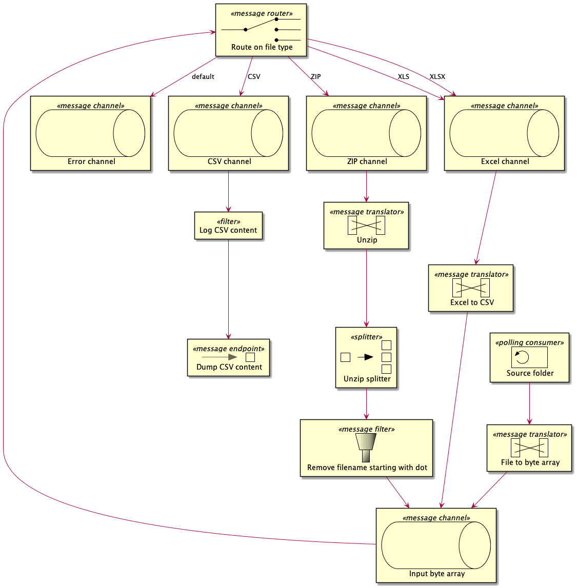

# Experiment: Spring-integration

This project aims to experiment with [spring-integration](https://spring.io/projects/spring-integration), especially with its [Java DSL](https://docs.spring.io/spring-integration/docs/current/reference/html/dsl.html#java-dsl).

To do so, we will build a simple file flow that takes files into a source folder and extract, from those input files, CSV content that we dump in a target folder.

## Idea



There is 1 entry :

- the source folder poller

There are 2 exits :

- the dump to target folder
- the error channel

## Test me

```sh
mvn spring-boot:run
```

Once started, move a file from `data/source-example` to `data/source`.
You should see some log about what is going on in the system.
Also, you should notice some new files into `data/target`.

## Features

- [x] java: works with spring
- [x] endpoint: read file from file system
- [x] transformer: file to byte array
- [x] transformer: Zip archive to file entries
- [x] transformer: Excel to CSV
- [ ] transformer: PGP decryption
- [x] handler: basic data dump on System.out
- [x] error handling: explicit error channel
- [ ] error handling: forward all exception to default error channel
- [ ] error handling: dead letter queue redirect to error channel
- [x] monitoring: expose metrics
- [x] maintenance: expose graph structure

## Integration graph

Spring integration allows exposing graph structure:

- through HTTP: http://localhost:9001/actuator/integrationgraph
- through JMX: check _jConsole_ : `MBeans > org.springframework.boot > Endpoint > Integrationgarph`

Then, data can be used to create a graph visualization.
(Legends says that [Spring-flo](https://github.com/spring-projects/spring-flo) could be used with its _Angular-1.x_ branch but i couldn't make it work)

## Metrics

Metrics are exposed thanks to [micrometer](https://micrometer.io/)'s meter:

- through HTTP:
  - http://localhost:9001/actuator/metrics/spring.integration.channels
  - http://localhost:9001/actuator/metrics/spring.integration.handlers
  - http://localhost:9001/actuator/metrics/spring.integration.receive
  - http://localhost:9001/actuator/metrics/spring.integration.sources
- through JMX: check _jConsole_ : `MBeans > metrics`, there are gauges, meters and timers (with interesting statistics)
